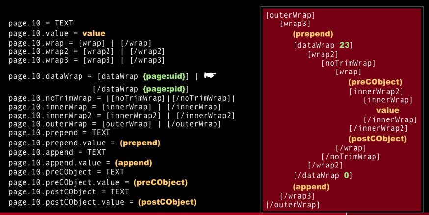

.. ==================================================
.. FOR YOUR INFORMATION 
.. --------------------------------------------------
.. -*- coding: utf-8 -*- with BOM.  ÄÖÜäöüß

.. include:: ../../Includes.txt

=================================
stdWrap 
=================================

stdWrap visual overview
=======================

Two figures courtesy of Xavier Perseguers.
Read about stdWrap in the TyposcriptReference: :ref:`t3tsref:stdWrap`.
These figures have been contributed with issue :forge:`39684` .

.. image:: stdwrap-menu.png

.. toctree: :
   :maxdepth: 5
   :glob:
   :titlesonly:

   *
